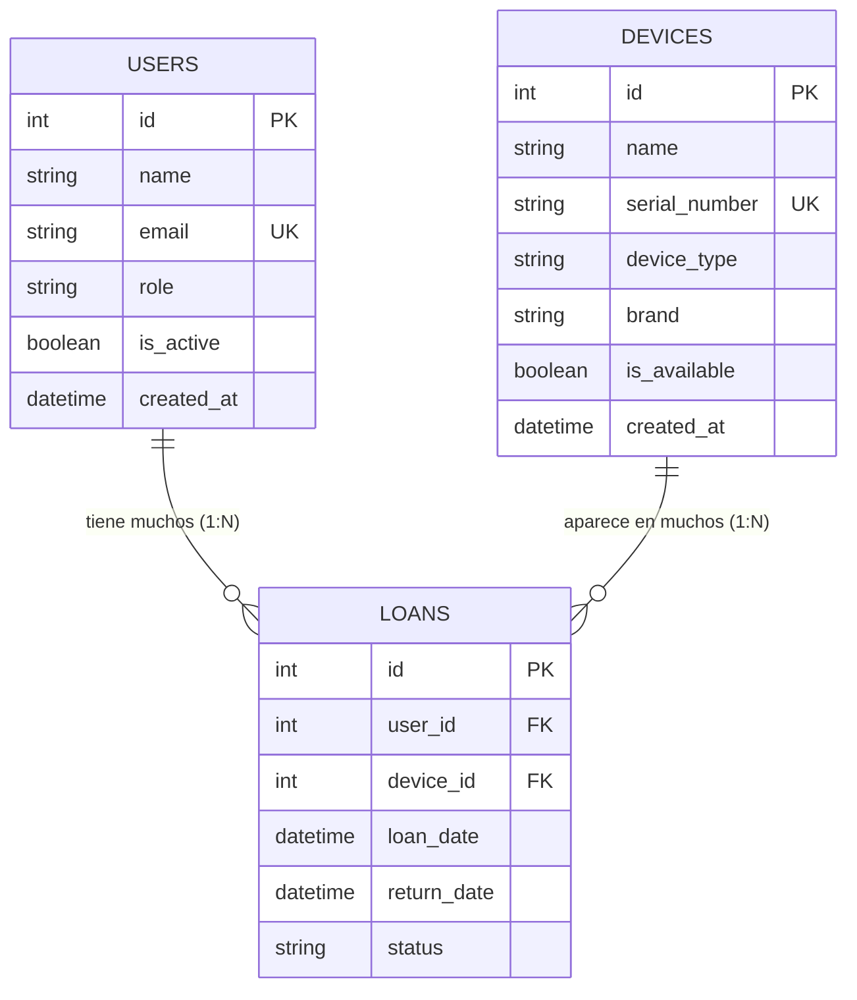

# device_systems — FastAPI Avanzado (EV10)

API REST profesional para la gestión de usuarios, dispositivos tecnológicos y préstamos desarrollada con **FastAPI**, **SQLAlchemy 2.0**, **Alembic**, **Pydantic v2** y **SQLite**.

> **Actividad:** GA1-220501096-01-AA1-EV10: Migraciones con Alembic, Asociaciones de Modelos y Consultas con Joins en `device_systems`.  
> **Rama de trabajo unificada:** `device_systems_alembic_relaciones` ➔ `main`

---

## Tabla de Contenidos

1. [Tecnologías Utilizadas](#tecnologías-utilizadas)
2. [Instalación y Ejecución](#instalación-y-ejecución)
3. [Estructura del Proyecto](#estructura-del-proyecto)
4. [Modelos y Asociaciones](#modelos-y-asociaciones)
5. [Endpoints de la API](#endpoints-de-la-api)
6. [Reglas de Negocio y Manejo de Errores](#reglas-de-negocio-y-manejo-de-errores)
7. [Evidencias de Aprendizaje Requeridas por la Guía](#evidencias-de-aprendizaje-requeridas-por-la-guía)
   - [1. Inicialización de Alembic](#1-inicialización-de-alembic)
   - [2. Creación de Migración](#2-creación-de-migración)
   - [3. Aplicación de Migración e Historial](#3-aplicación-de-migración-e-historial)
   - [4. Estructura de Tablas Generadas en SQLite](#4-estructura-de-tablas-generadas-en-sqlite)
   - [5. Documentación Swagger UI](#5-documentación-swagger-ui)
   - [6. Creación de Usuario, Dispositivo y Préstamo](#6-creación-de-usuario-dispositivo-y-préstamo)
   - [7. Regla de Negocio: Dispositivo no Disponible (409 Conflict)](#7-regla-de-negocio-dispositivo-no-disponible-409-conflict)
   - [8. Consultas con Joins (`/loans/details`)](#8-consultas-con-joins-loansdetails)
   - [9. Filtros Avanzados](#9-filtros-avanzados)
   - [10. Devolución de Dispositivo y Liberación](#10-devolución-de-dispositivo-y-liberación)
8. [Pruebas Automatizadas con Pytest](#pruebas-automatizadas-con-pytest)
9. [Reflexión Técnica](#reflexión-técnica)
10. [Guion para la Socialización (5 Minutos)](#guion-para-la-socialización-5-minutos)

---

## Tecnologías Utilizadas

- **Python:** 3.14 / 3.12+
- **FastAPI:** Framework backend web de alto rendimiento.
- **SQLAlchemy 2.0:** ORM declarativo con tipado estático `Mapped` y `mapped_column`.
- **Alembic:** Sistema de control de versiones y migraciones de esquemas de base de datos.
- **Pydantic v2:** Validación estricta de datos, serialización y schemas de respuesta.
- **SQLite:** Base de datos relacional ligera con soporte ACID.
- **Uvicorn:** Servidor ASGI para ejecución asíncrona.
- **Pytest & TestClient:** Pruebas funcionales e integración automatizada.

---

## Instalación y Ejecución

### 1. Clonar el repositorio y entrar al directorio

```powershell
git clone https://github.com/Pafuna08/device_systems.git
cd device_systems
```

### 2. Crear y activar entorno virtual

```powershell
python -m venv venv
.\venv\Scripts\activate
```

### 3. Instalar dependencias

```powershell
pip install -r requirements.txt
```

### 4. Aplicar migraciones con Alembic

```powershell
alembic upgrade head
```

### 5. Iniciar la aplicación

```powershell
python -m uvicorn app.main:app --reload --host 127.0.0.1 --port 8000
```

- **Swagger UI interactivo:** [http://127.0.0.1:8000/docs](http://127.0.0.1:8000/docs)
- **ReDoc alternativo:** [http://127.0.0.1:8000/redoc](http://127.0.0.1:8000/redoc)

---

## Estructura del Proyecto

El proyecto sigue una arquitectura modular en capas (Presentación, Servicios, Persistencia, Dependencias):

```text
device_systems/
│── alembic/
│   │── versions/
│   │   └── cff4dc36cc7a_create_devices_and_loans_tables.py
│   │── env.py
│   │── README
│   └── script.py.mako
│── alembic.ini
│── app/
│   │── database/
│   │   └── connection.py
│   │── dependencies/
│   │   ├── database_dependency.py
│   │   └── user_dependencies.py
│   │── models/
│   │   ├── __init__.py
│   │   ├── user_model.py
│   │   ├── device_model.py
│   │   └── loan_model.py
│   │── routes/
│   │   ├── user_routes.py
│   │   ├── device_routes.py
│   │   └── loan_routes.py
│   │── schemas/
│   │   ├── user_schema.py
│   │   ├── device_schema.py
│   │   └── loan_schema.py
│   │── services/
│   │   ├── user_service.py
│   │   ├── device_service.py
│   │   └── loan_service.py
│   │── main.py
│   └── __init__.py
│── evidencias/
│   ├── ev10_01_alembic_init.png
│   ├── ev10_02_alembic_revision.png
│   ├── ev10_03_alembic_upgrade_history.png
│   ├── ev10_04_estructura_tablas.png
│   ├── ev10_05_swagger_general.png
│   ├── ev10_06_post_creaciones.png
│   ├── ev10_07_error_dispositivo_no_disponible.png
│   ├── ev10_08_loans_details_joins.png
│   ├── ev10_09_filtros_avanzados.png
│   ├── ev10_10_devolucion_dispositivo.png
│   └── EV10_RESULTADOS.md
│── tests/
│   └── test_device_systems_api.py
│── device_systems.db
│── requirements.txt
│── README.md
└── .gitignore
```

---

## Modelos y Asociaciones

Se implementó el modelado relacional entre 3 entidades mediante claves foráneas y relaciones bidireccionales con `relationship()` y `back_populates`:



- **`User` ➔ `Loan` (One-to-Many):** Un usuario puede tener múltiples préstamos registrados en su historial.
- **`Device` ➔ `Loan` (One-to-Many):** Un dispositivo conserva el historial de todos los préstamos pasados y activos.
- **`Loan` ➔ `User` y `Device` (Many-to-One):** Cada registro de préstamo apunta a exactamente un usuario prestatario y a un dispositivo físico.

---

## Endpoints de la API

### Recurso `/users`

- `GET /users`: Listar usuarios con filtros por `role`, `is_active` y ordenamiento.
- `GET /users/{user_id}`: Consultar usuario por ID.
- `POST /users`: Crear usuario (valida correo duplicado: `400 Bad Request`).
- `PUT /users/{user_id}`: Reemplazar completamente un usuario.
- `PATCH /users/{user_id}`: Actualizar parcialmente datos de usuario.
- `DELETE /users/{user_id}`: Eliminar usuario (`204 No Content`).

### Recurso `/devices`

- `GET /devices`: Listar dispositivos con filtros (`device_type`, `is_available`, `brand`, `search`).
- `GET /devices/{device_id}`: Consultar equipo por ID.
- `POST /devices`: Crear dispositivo (valida número de serie único: `400 Bad Request`).
- `PUT /devices/{device_id}`: Reemplazar dispositivo.
- `PATCH /devices/{device_id}`: Actualizar parcialmente atributos.
- `DELETE /devices/{device_id}`: Eliminar dispositivo (`204 No Content`).

### Recurso `/loans`

- `GET /loans`: Listar préstamos con información anidada y filtros.
- `GET /loans/details`: **Endpoint específico de Joins** con filtros combinados (`status`, `user_email`, `device_type`, `user_id`, `device_id`, `search`).
- `GET /loans/{loan_id}`: Consultar un préstamo puntual con detalles del usuario y dispositivo.
- `POST /loans`: Registrar un préstamo validando usuario, equipo y disponibilidad.
- `PATCH /loans/{loan_id}/return`: Devolver equipo, asignar fecha de retorno y cambiar `is_available` a `True`.
- `GET /users/{user_id}/loans`: Historial de préstamos de un usuario.
- `GET /devices/{device_id}/loans`: Historial de préstamos de un equipo.

---

## Reglas de Negocio y Manejo de Errores

|         Código HTTP          | Significado          | Escenario en la API                                                                                               |
| :--------------------------: | :------------------- | :---------------------------------------------------------------------------------------------------------------- |
|       **201 Created**        | Creado               | Creación exitosa de usuario, dispositivo o préstamo.                                                              |
|          **200 OK**          | Éxito                | Consultas exitosas, filtros aplicados y devolución de préstamo.                                                   |
|      **204 No Content**      | Sin contenido        | Eliminación física exitosa de usuarios o dispositivos.                                                            |
|     **400 Bad Request**      | Solicitud incorrecta | Correo electrónico duplicado en usuarios o número de serie duplicado en dispositivos.                             |
|      **404 Not Found**       | No encontrado        | Usuario, dispositivo o préstamo inexistente en la base de datos.                                                  |
|       **409 Conflict**       | Conflicto de negocio | Intento de prestar un equipo no disponible (`is_available == False`) o intentar devolver un préstamo ya devuelto. |
| **422 Unprocessable Entity** | Error de validación  | Carga útil con tipos inválidos, cadenas que no cumplen longitud mínima o valores fuera de enumeración literal.    |

---

## Evidencias de Aprendizaje Requeridas por la Guía

A continuación se presentan las evidencias visuales y técnicas de cada uno de los 10 aspectos solicitados:

### 1. Inicialización de Alembic

Instalación del paquete `alembic>=1.14.0`, ejecución de `alembic init alembic` y verificación de los archivos creados (`alembic.ini`, `env.py`, `script.py.mako`):


---

### 2. Creación de Migración

Generación automática de la revisión mediante `alembic revision --autogenerate -m "create devices and loans tables"` con detección de `Base.metadata`:


---

### 3. Aplicación de Migración e Historial

Aplicación de las modificaciones en la base de datos con `alembic upgrade head`, verificación del estado actual (`alembic current`) e historial (`alembic history`):


---

### 4. Estructura de Tablas Generadas en SQLite

Esquema relacional de las tablas `users`, `devices`, `loans` y `alembic_version` con claves primarias, índices, restricciones de unicidad y claves foráneas:


---

### 5. Documentación Swagger UI

Interfaz OpenAPI interactiva disponible en `/docs`, categorizada por los tres tags: `Users`, `Devices` y `Loans` con todos sus métodos:


---

### 6. Creación de Usuario, Dispositivo y Préstamo

Registro exitoso de un nuevo usuario, un nuevo equipo tecnológico y la vinculación de ambos mediante la creación de un préstamo con código `201 Created`:


---

### 7. Regla de Negocio: Dispositivo no Disponible (409 Conflict)

Protección de concurrencia e integridad: cuando un segundo usuario intenta solicitar un equipo que ya se encuentra prestado (`is_available: false`), el sistema rechaza la operación con `409 Conflict`:


---

### 8. Consultas con Joins (`/loans/details`)

Consulta que combina información entre `loans`, `users` y `devices` usando `select(Loan).join(User).join(Device)` y serializada en `LoanDetailResponse`:


---

### 9. Filtros Avanzados

Ejecución de filtros combinados por parámetros en URL: estado del préstamo (`status=active`), tipo de equipo (`device_type=laptop`) y disponibilidad:


---

### 10. Devolución de Dispositivo y Liberación

Flujo de devolución mediante `PATCH /loans/{loan_id}/return`: el estado pasa a `returned`, se registra la fecha de devolución y el equipo vuelve a estar disponible (`is_available: true`) preservando el historial:


---

## Pruebas Automatizadas con Pytest

Se cuenta con una suite de pruebas en [`tests/test_device_systems_api.py`](tests/test_device_systems_api.py) que valida automáticamente los 12 escenarios de la **Fase 13**:

```powershell
.\venv\Scripts\python.exe -m pytest -v
```

Resultado de la ejecución:

```text
============================= test session starts =============================
platform win32 -- Python 3.14.7, pytest-9.1.1, pluggy-1.6.0
rootdir: C:\Users\PABLO 08\OneDrive\Escritorio\Python Avanzado\device_systems
plugins: anyio-4.14.2
collected 3 items

tests/test_device_systems_api.py::test_swagger_docs_available PASSED     [ 33%]
tests/test_device_systems_api.py::test_users_endpoint_lists_users PASSED [ 66%]
tests/test_device_systems_api.py::test_phase_13_minimal_functional_scenarios PASSED [100%]

======================== 3 passed, 4 warnings in 2.64s ========================
```

---

## Reflexión Técnica

### 1. Importancia del control de versiones en bases de datos con Alembic

En el desarrollo de software moderno, el código de la aplicación y la estructura de la base de datos deben evolucionar de manera coordinada. Las migraciones con Alembic proporcionan:

- **Trazabilidad y reproducibilidad:** Cada cambio en el esquema (creación de tablas, adición de columnas o índices) se documenta como una revisión identificable e inmutable.
- **Entornos consistentes:** Garantiza que el entorno local de desarrollo, el servidor de pruebas y producción compartan exactamente la misma definición de datos sin depender de scripts manuales propensos a error humano.
- **Rollback seguro:** Capacidad de revertir cambios (`downgrade`) en caso de anomalías sin pérdida de control del sistema.

### 2. Integridad referencial y asociaciones entre modelos

El uso de claves foráneas (`ForeignKey`) y asociaciones ORM (`relationship`, `back_populates`) aporta dos ventajas decisivas:

- **Integridad a nivel de motor:** Previene la existencia de registros huérfanos (un préstamo nunca puede apuntar a un usuario o dispositivo inexistente).
- **Productividad y expresividad:** A nivel de aplicación, permite navegar directamente entre objetos (`loan.user.name`, `device.loans`) simplificando la lógica de negocio y las validaciones.

### 3. Consultas avanzadas con Joins y optimización

En lugar de incurrir en el problema del $N+1$ (realizar múltiples consultas separadas a la base de datos por cada registro), el uso de `join()` explícito permite que el motor relacional resuelva en una única operación la combinación de datos entre prestatario, equipo y préstamo. Combinado con operadores flexibles como `ilike()`, `and_()` y `or_()`, la API ofrece capacidades de búsqueda robustas y eficientes para el cliente.

---

## Guion para la Socialización (5 Minutos)

Estructura sugerida para la exposición oral del aprendiz frente al instructor:

1. **¿Qué cambios se realizaron respecto a la versión anterior? (45 s):**  
   _"Evolucionamos la API de un CRUD básico con persistencia exclusiva de usuarios a una plataforma relacional de préstamos tecnológicos. Incorporamos dos nuevos recursos (`/devices` y `/loans`), versionamiento de esquema con Alembic y consultas combinadas con joins."_

2. **¿Cómo se configuró Alembic? (45 s):**  
   _"Se inicializó con `alembic init alembic`. En `alembic.ini` se definió la URL de conexión a SQLite. En `alembic/env.py` se enlazó la metadata del ORM (`target_metadata = Base.metadata`) e importamos los modelos (`User`, `Device`, `Loan`) para que el detector reconozca todas las entidades."_

3. **¿Qué migraciones se generaron? (30 s):**  
   _"Ejecutamos `alembic revision --autogenerate -m 'create devices and loans tables'`, la cual generó el archivo de migración con las tablas `devices` y `loans`, sus índices y llaves foráneas. Posteriormente se aplicó con `alembic upgrade head`."_

4. **¿Cómo se relacionaron User, Device y Loan? (45 s):**  
   _"Diseñamos relaciones uno a muchos entre Usuario y Préstamos, y entre Dispositivo y Préstamos. En la tabla `loans` establecimos dos claves foráneas (`user_id` y `device_id`). En el ORM usamos `relationship()` con `back_populates` en ambos extremos para permitir acceso bidireccional y cascadas ordenadas."_

5. **¿Cómo funcionan las consultas con joins? (45 s):**  
   _"En `loan_service.py` construimos la consulta con `select(Loan).join(User).join(Device)`. Esto combina las tres tablas en una sola instrucción SQL, permitiendo que la API responda en el endpoint `/loans/details` con un esquema Pydantic que anida la información del usuario y del dispositivo."_

6. **¿Cómo se aplicaron los filtros avanzados? (30 s):**  
   _"A través de parámetros de consulta opcionales (`Query`), construyendo filtros dinámicos con `where()`, `and_()`, `or_()` y operadores como `ilike()` para búsquedas insensibles a mayúsculas y minúsculas por estado, correo o tipo de dispositivo."_

7. **¿Qué aprendió sobre modelado relacional en APIs REST? (30 s):**  
   _"Aprendí que la coherencia de datos debe asegurarse tanto en el motor de base de datos con claves foráneas como en la capa de servicios mediante validaciones de negocio (como verificar disponibilidad antes de prestar), y que las migraciones son imprescindibles para la entrega continua y el desarrollo en equipo."_
