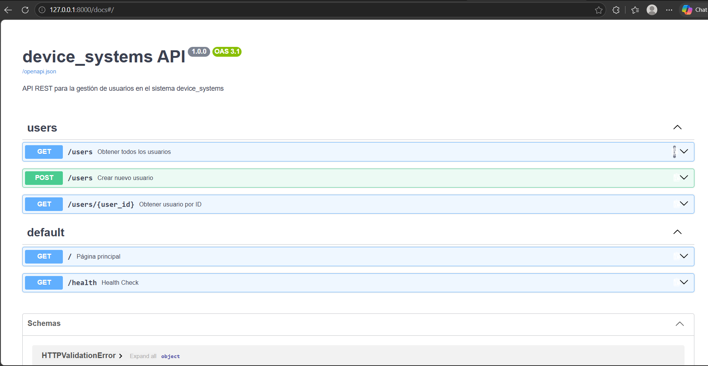
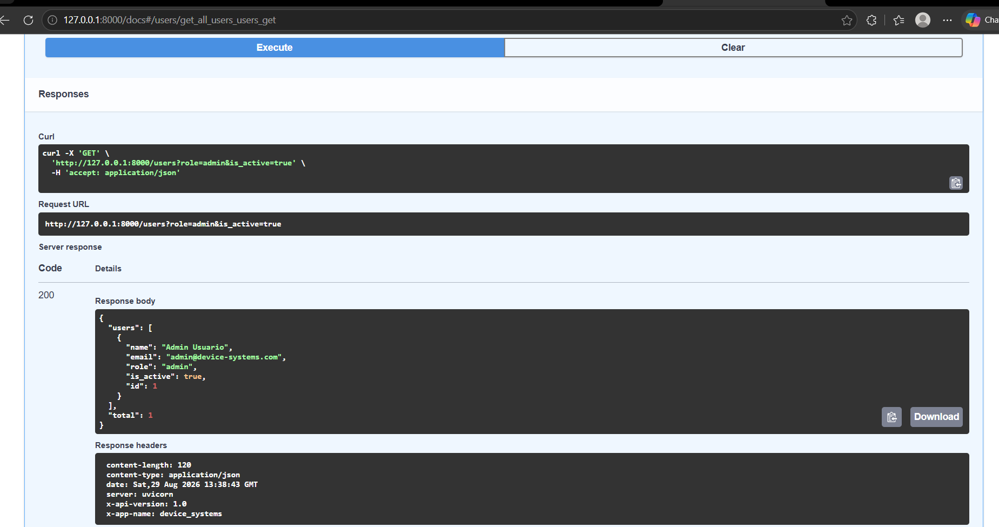
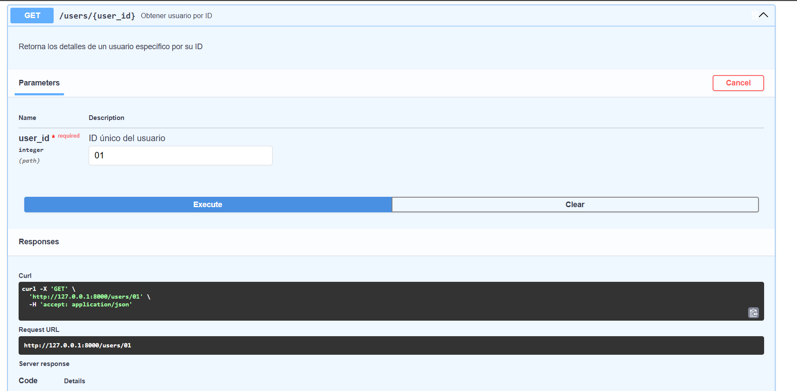
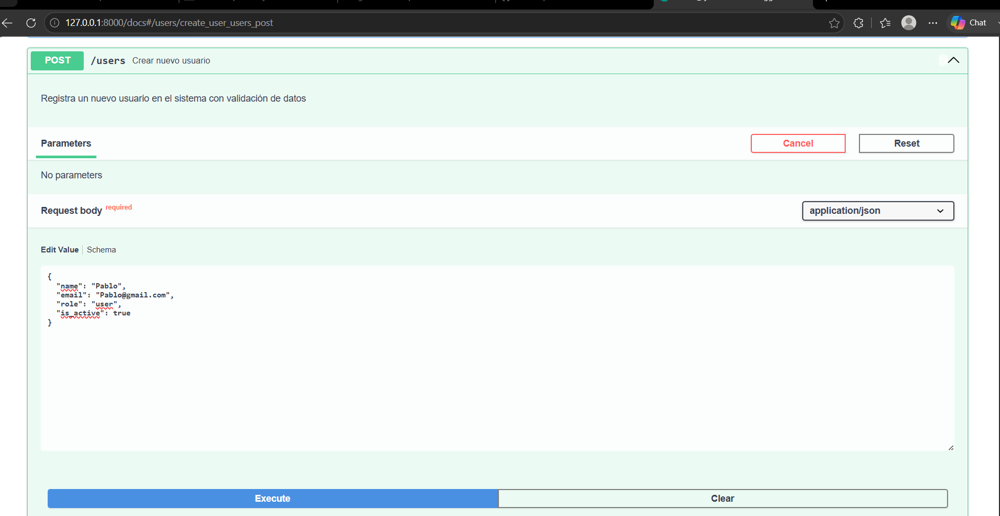
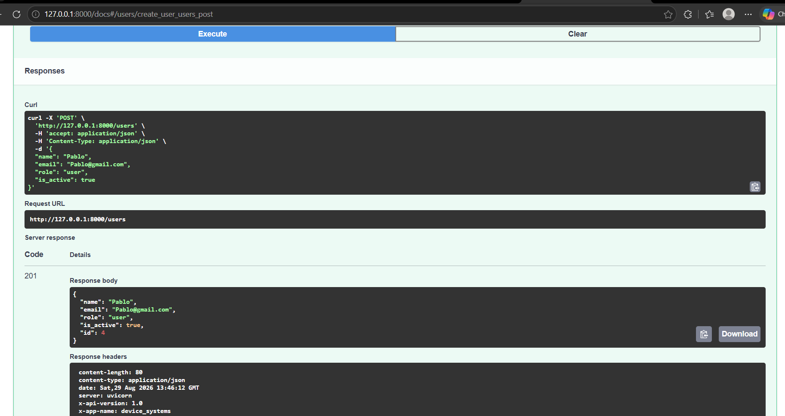
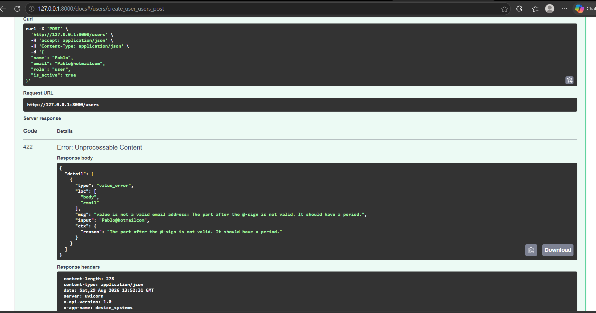

# 🚀 device_systems API - Gestión de Usuarios

API REST desarrollada con FastAPI para la gestión del recurso usuarios del sistema `device_systems`.

## 📋 Descripción

Este proyecto implementa una API REST para administrar usuarios, aplicando validaciones de datos, filtros por parámetros de consulta, endpoints GET y POST, manejo de errores y documentación automática con Swagger UI.

El desarrollo se realizó siguiendo la guía de la actividad, utilizando una estructura modular y comprobando la funcionalidad con evidencia real durante la ejecución local de la API.

## ✅ Requisitos cumplidos

- Configuración correcta del proyecto
- Modelo de usuario con Pydantic v2
- GET /users
- GET /users/{user_id}
- GET /users?role=admin
- GET /users?is_active=true
- POST /users
- Validación de campos con Pydantic
- Detección de correos duplicados
- Modelos de respuesta (Response Models)
- Cabeceras HTTP personalizadas
- Documentación automática con Swagger UI y ReDoc

## 🧱 Estructura del proyecto

```text
device_systems/
├── .env.example
├── .git/
├── .gitignore
├── app/
│   ├── __init__.py
│   ├── main.py
│   ├── routes/
│   │   ├── __init__.py
│   │   └── user_routes.py
│   └── schemas/
│       ├── __init__.py
│       └── user_schema.py
├── device_systems_postman.json
├── device_systems_thunder.json
├── evidencias/
│   ├── 1.png
│   ├── 2.png
│   ├── 3.png
│   ├── 4.0.png
│   ├── 4.1.png
│   ├── 5.0.png
│   └── 5.1.png
├── GITHUB_SETUP.md
├── INICIO_RAPIDO.md
├── QUICKSTART.md
├── README.md
├── requirements.txt
├── RESUMEN_PROYECTO.md
├── venv/
└── .gitignore
```

## 🛠️ Instalación

### 1. Clonar el proyecto

```bash
git clone https://github.com/Pafuna08/device_systems.git
cd device_systems
```

### 2. Crear entorno virtual

```bash
python -m venv venv
venv\Scripts\activate
```

### 3. Instalar dependencias

```bash
pip install -r requirements.txt
```

## ▶️ Ejecutar la API

Desde la raíz del proyecto:

```bash
uvicorn app.main:app --reload --host 127.0.0.1 --port 8000
```

La API estará disponible en:

- Swagger UI: http://127.0.0.1:8000/docs
- ReDoc: http://127.0.0.1:8000/redoc

## 📡 Endpoints implementados

| Método | Endpoint              | Descripción                |
| ------ | --------------------- | -------------------------- |
| GET    | /users                | Lista todos los usuarios   |
| GET    | /users/{user_id}      | Consulta un usuario por ID |
| POST   | /users                | Crea un usuario nuevo      |
| GET    | /users?role=admin     | Filtra por rol             |
| GET    | /users?is_active=true | Filtra por estado          |

## 🔒 Validaciones del modelo

El esquema de usuario valida lo siguiente:

- `name`: obligatorio, mínimo 3 caracteres
- `email`: formato válido y único
- `role`: solo puede ser `admin`, `support` o `user`
- `is_active`: booleano

## 🧪 Evidencias reales de funcionamiento

A continuación se presentan ejemplos ejecutados en la API en funcionamiento, con respuestas reales obtenidas durante la validación del proyecto.

### 1. GET /users

Ejecutado en la API real:

```bash
curl http://127.0.0.1:8000/users
```

Respuesta real observada:

```json
{
  "users": [
    {
      "name": "Admin Usuario",
      "email": "admin@device-systems.com",
      "role": "admin",
      "is_active": true,
      "id": 1
    },
    {
      "name": "Support Usuario",
      "email": "support@device-systems.com",
      "role": "support",
      "is_active": true,
      "id": 2
    },
    {
      "name": "Usuario Normal",
      "email": "user@device-systems.com",
      "role": "user",
      "is_active": false,
      "id": 3
    }
  ],
  "total": 3
}
```

### 2. GET /users/1

Ejecutado en la API real:

```bash
curl http://127.0.0.1:8000/users/1
```

Respuesta real observada:

```json
{
  "name": "Admin Usuario",
  "email": "admin@device-systems.com",
  "role": "admin",
  "is_active": true,
  "id": 1
}
```

### 3. POST /users - creación exitosa

Ejecutado con:

```bash
curl -X POST "http://127.0.0.1:8000/users" \
  -H "Content-Type: application/json" \
  -d '{"name":"Ana Gómez","email":"ana.gomez@device-systems.com","role":"user","is_active":true}'
```

Respuesta real observada:

```json
{
  "name": "Ana Gómez",
  "email": "ana.gomez@device-systems.com",
  "role": "user",
  "is_active": true,
  "id": 4
}
```

### 4. POST /users - validación con error

Ejecutado con este cuerpo inválido:

```json
{
  "name": "A",
  "email": "correo_invalido",
  "role": "admin",
  "is_active": true
}
```

Comando ejecutado:

```bash
curl -X POST "http://127.0.0.1:8000/users" \
  -H "Content-Type: application/json" \
  -d '{"name":"A","email":"correo_invalido","role":"admin","is_active":true}'
```

Respuesta real observada:

```json
{
  "detail": [
    {
      "type": "string_too_short",
      "loc": ["body", "name"],
      "msg": "String should have at least 3 characters",
      "input": "A",
      "ctx": {
        "min_length": 3
      }
    },
    {
      "type": "value_error",
      "loc": ["body", "email"],
      "msg": "value is not a valid email address: An email address must have an @-sign.",
      "input": "correo_invalido",
      "ctx": {
        "reason": "An email address must have an @-sign."
      }
    }
  ]
}
```

### 5. Evidencia de Swagger UI

La documentación interactiva de la API se revisó en:

```text
http://127.0.0.1:8000/docs
```

Las capturas generadas y almacenadas en la carpeta `evidencias` son 7 archivos en total, y corresponden a los siguientes momentos de validación:

#### Captura 1 - Swagger UI



#### Captura 2 - Evidencia de pruebas GET /users



#### Captura 3 - Evidencia de pruebas GET /users/{user_id}



#### Captura 4A - Evidencia de pruebas POST /users (creación exitosa)



#### Captura 4B - Evidencia de pruebas POST /users (respuesta del servidor)



#### Captura 5A - Evidencia de validaciones y errores en POST /users


#### Captura 5B - Evidencia adicional de validación y respuesta de error



Estas evidencias corresponden a la ejecución de los endpoints principales del proyecto, a la validación de errores de entrada y a la respuesta del sistema en el recurso `users`.

## 🧾 Cabeceras HTTP personalizadas

La API incluye las siguientes cabeceras en sus respuestas:

```http
X-App-Name: device_systems
X-API-Version: 1.0
```

## 📌 Reflexión personal

Este proyecto permitió fortalecer el conocimiento sobre la construcción de APIs REST con FastAPI, la validación de datos con Pydantic, el uso de parámetros path y query, y la generación automática de documentación mediante Swagger UI. Además, brindó una comprensión clara del manejo de respuestas estructuradas y de validaciones de entrada para evitar errores del cliente.

## 🧠 Conclusión

El proyecto cumple con la funcionalidad principal solicitada por la guía: gestión del recurso usuarios, validación de datos con Pydantic, endpoints GET y POST, filtros por query, manejo de errores y documentación automática. La evidencia de funcionamiento quedó documentada en este README y en la carpeta de capturas del proyecto.

## 📜 Licencia

Este proyecto se entrega con fines de aprendizaje y desarrollo académico.
